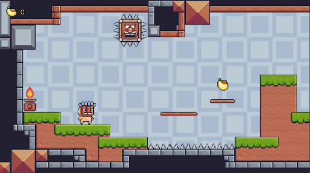
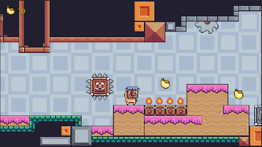
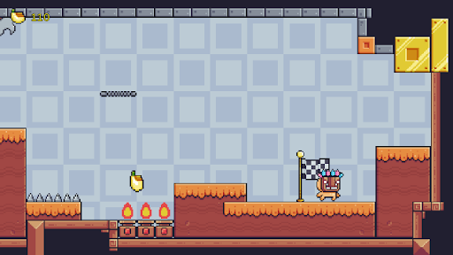

# Pixel Adventure

## Description
**Pixel Adventure** is a simple yet engaging pixel art game created using Unity. The game features a single level where the player must navigate through various traps to reach the end. The player's objective is to avoid all the traps and collect bananas to score points.

## Controls
- **A**: Move left
- **D**: Move right
- **Spacebar**: Jump

## Game Screenshots
Here are some screenshots of the game:







## Installation
To play **Pixel Adventure**, follow these steps:

### Prerequisites
- Ensure you have Unity installed. You can download it from the [Unity official website](https://unity.com/).

### Running the Game
1. Clone this repository to your local machine:
    ```bash
    git clone https://github.com/mrizkyrn/Pixel-Adventure.git
    cd Pixel-Adventure
    ```
2. Open the project in Unity:
    - Launch Unity Hub.
    - Click on the "Add" button and navigate to the folder where you cloned the repository.
    - Select the folder and open the project.
3. Once the project is open, click on the "Play" button in the Unity editor to start the game.
5. Create a pull request explaining your changes.

## Contact
For any questions or suggestions, feel free to reach out to the project maintainer at [mrizkyr2411@gmail.com](mailto:mrizkyr2411@gmail.com).


---

Enjoy navigating through traps and collecting bananas in **Pixel Adventure**!
